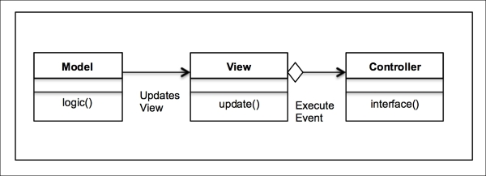
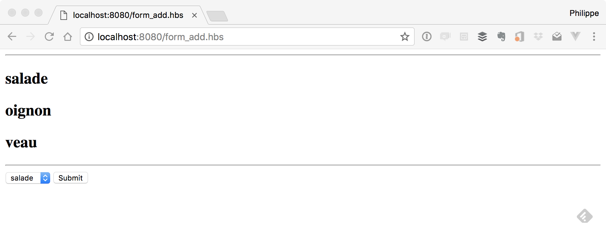
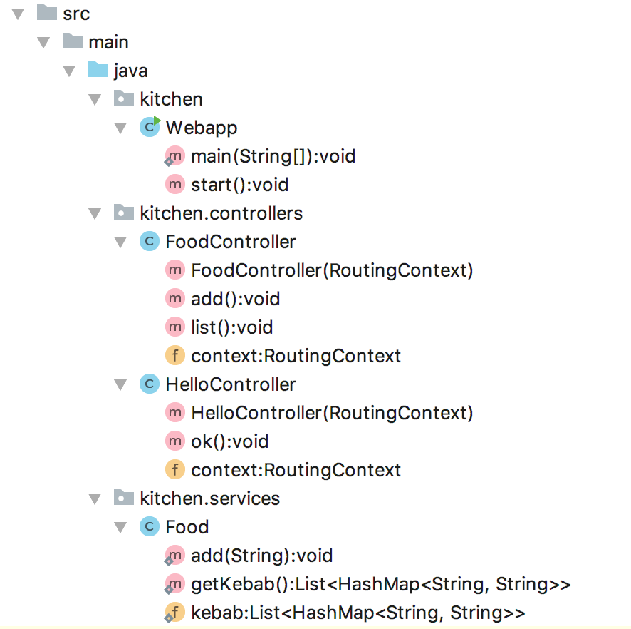

# isi3-tp-MVC

## Exercice 1: MVC

- Utiliser le projet `kebab-mvc` (référencer le jar `vert-x.jar` présent dans `../libs`)
- Regarder les codes d'exemple
- Se les faire expliquer (par moi)



### Partie 1

- Faire un formulaire pour ajouter des ingrédients dans un Kebab



> :warning: faire ça **façon MVC**, soyez imaginatifs



**Exemple de contrôleur**:
```java
package kitchen.controllers;

import io.vertx.ext.web.RoutingContext;

public class HelloController {
    RoutingContext context = null;

    public HelloController(RoutingContext context) {
        this.context = context;
    }

    public void ok() {
        context.put("message", "hello world");
        context.next();
    }
}
```

### Partie 2

- Ajouter la suppression

## Exercice 2: MVVM

resource: https://en.wikipedia.org/wiki/Model%E2%80%93view%E2%80%93viewmodel

- Utiliser le projet `kebab-spa` (référencer le jar `vert-x.jar` présent dans `../libs`)
- Regarder les codes d'exemple
- Se les faire expliquer (par moi)


### A faire

- Là même chose que dans l'exercice 1, mais en mode  "Single Page Application"
  - vous n'utilisez plus les templates côté serveur
  - vous utilisez une application JavaScript et du HTML (Vue.js)

